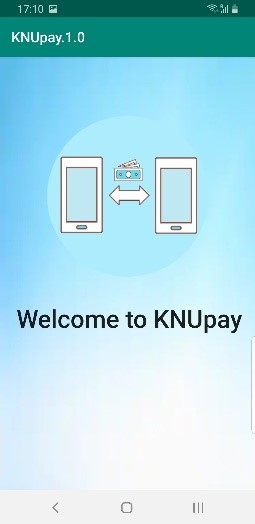
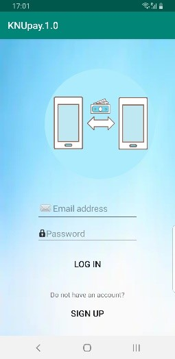
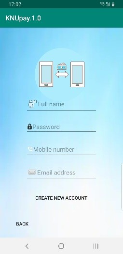
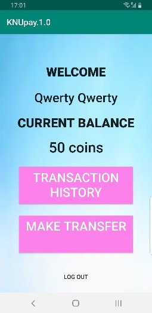
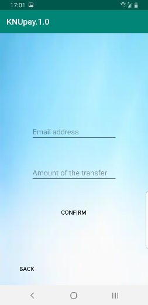

# NFC_Payment_moblie_app
Mobile aplication in Android studio for managing money transactions via NFC

## Assumptions:
'In our application everyone will be able to create their own password protected account. On account all information about the available funds (expressed in our own currency KNUcoin) will be stored. There will also be access to transaction history and the option of transferring money. We would like to allow making transfers using NFC technology, which will speed up the process of giving money back. All what will be needed to use KNUpay is Internet connection and smartphone supporting NFC.'

## Results:
 
 
 
 

From the login panel, if the user does not have an account, he can go to the registration window. Once the user is logged in correctly, the application redirects to the home screen, where user data is displayed, as well as there is possibility to move to other options. After logging out the user is redirected to the login panel. During both registration and logging in, if the user leaves an empty field, a message appears asking to fill it in. All data are stored in a database, provided that even the administrator of the database does not have access to the password.
New user automatically gets 50 coins of account balance. Unfortunately, our group did not manage to complete the money transfer option and therefore also the transaction history. However, proper windows were created, ready to handle these actions in the future.

## Tools:
During this project, the most useful tool was **Android Studio** where we created a whole frontend. The **git version control system** allowed us to work on different devices on the same files. To build the application we used **Gradle system** and **Java** language. **Firebase** was used to store data in the database and ensure the authentication process. To process graphics, create presentations and reports we used tools provided by Microsoft corporation.
